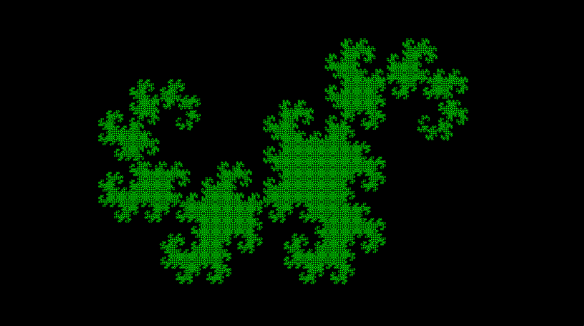

# Fractal Dragon

A dragon curve is any member of a family of self-similar fractal curves, which can be approximated by recursive methods such as Lindenmayer systems. The dragon curve is probably most commonly thought of as the shape that is generated from repeatedly folding a strip of paper in half, although there are other curves that are called dragon curves that are generated differently.

The Heighway dragon can be constructed from a base line segment by repeatedly replacing each segment by two segments with a right angle and with a rotation of 45° alternatively to the right and to the left:

The Heighway dragon is also the limit set of the following iterated function system in the complex plane:

with the initial set of points 

Using pairs of real numbers instead, this is the same as the two functions consisting of

Full text on Wikipedia:
https://en.wikipedia.org/wiki/Dragon_curve
